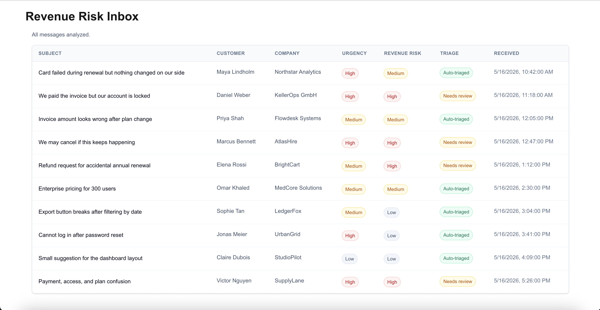
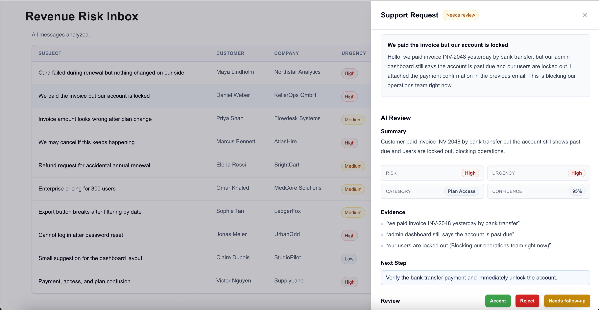
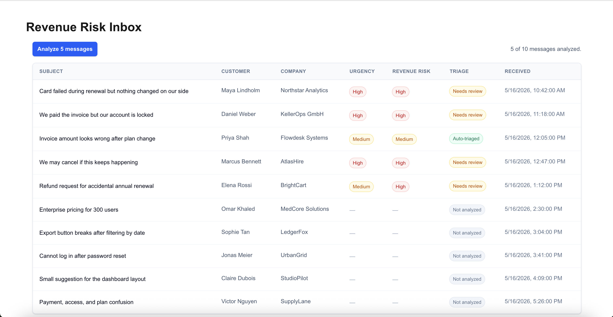

# Revenue Risk Inbox

An AI-assisted review queue for triaging customer support messages by revenue risk, urgency, and human-review need.

- Live demo: https://revenue-risk-inbox.vercel.app/  
- GitHub repo: [https://github.com/NadaSadek/revenue-risk-inbox](https://nadasadek.com/articles/designing-review-queue-for-revenue-risk-support-messages/)




## Why this exists

Support inboxes mix routine feedback with messages that can affect revenue, access, renewals, refunds, or churn.

A failed payment, a paid customer locked out of their account, and a dashboard layout suggestion should not receive the same operational priority. This project explores how structured AI output can help support teams identify which messages need faster review and why.

## What it does

Revenue Risk Inbox analyzes support messages and returns structured review data:

- urgency
- revenue risk
- category
- confidence
- evidence from the customer message
- recommended next action
- whether human review is needed

The UI then displays the results in an inbox table and a detail drawer for review.

## Review workflow

1. The user loads sample support messages.
2. The user analyzes messages in batches.
3. The app displays urgency, revenue risk, and triage status.
4. The user opens a message to compare the original request with the AI review.
5. High-risk or ambiguous cases are marked as needing human review.



## AI behavior

The app sends support requests to a server-side API route:

```txt
POST /api/analyze-support-requests
```

Each support request includes:

```ts
{
  id: string;
  customerName: string;
  companyName: string;
  receivedAt: string;
  subject: string;
  body: string;
}
```

The AI returns one structured analysis per message:

```ts
{
  messageId: string;
  urgency: "low" | "medium" | "high";
  revenueRisk: "low" | "medium" | "high";
  summary: string;
  recommendedAction: string;
  evidence: string[];
  confidence: number;
  needsHumanReview: boolean;
  category:
    | "failed_payment"
    | "invoice_issue"
    | "plan_access"
    | "cancellation_risk"
    | "refund_request"
    | "enterprise_sales"
    | "product_bug"
    | "account_issue"
    | "product_feedback"
    | "other";
}
```

The output is validated with Zod before it is used by the UI.


## States handled

The UI includes states for:

- not analyzed
- analyzing
- partially analyzed
- auto-triaged
- needs review
- empty or unavailable AI review



## Sample data

The demo includes 10 realistic support messages covering:

- failed payment
- paid but locked out
- invoice dispute
- cancellation threat
- refund request
- enterprise pricing
- product bug
- login issue
- low-risk product feedback
- mixed payment/access confusion

## Tech stack

- Next.js
- React
- TypeScript
- Tailwind CSS
- Vercel AI SDK
- Zod
- Vitest

## Running locally

Install dependencies:

```bash
npm install
```

Create `.env.local`:

```bash
AI_GATEWAY_API_KEY=your_key_here
```

Run the development server:

```bash
npm run dev
```

Open:

```txt
http://localhost:3000
```

## Available scripts

```bash
npm run dev
npm run build
npm run lint
npm run test
npm run test:watch
npm run format
npm run format:check
```

## Testing

The tests focus on the highest-risk contract issue in the project: making sure AI analyses are matched to the correct support request.

Run tests with:

```bash
npm run test
```

## Limitations

This is a v0 demo, not a production support system.

Current limitations:

- sample data is static
- review actions do not persist yet
- there is no authentication or user assignment
- there is no database
- there is no helpdesk or billing integration
- AI output quality depends on the model response and prompt constraints
- the app does not take billing, refund, or access actions automatically


## Project status

This is a v0 dfocused on AI product UX, structured output and revenue-risk support workflows.
